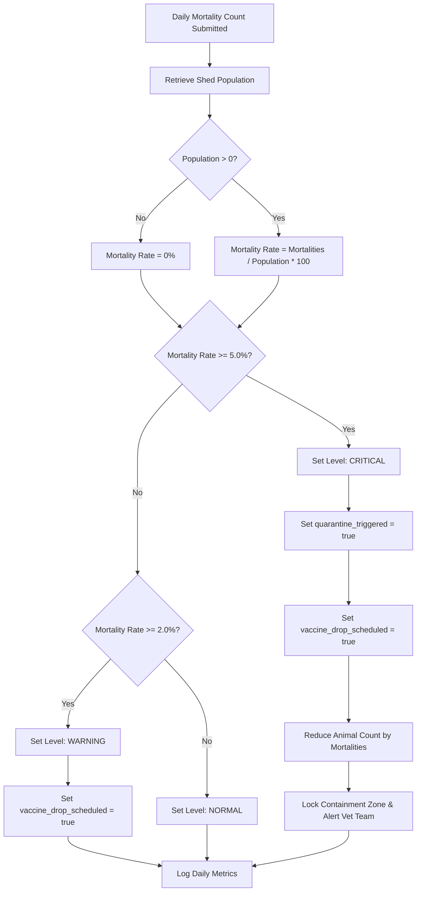

# 🛡️ Bio-Guard: Digital Farm Management Portal for Biosecurity

An expert-grade **Laravel MVC web portal** designed for **Biosecurity in Pig & Poultry Farms** (solving **SIH Problem SIH25006**). This platform enables modern livestock producers and veterinary authorities to proactively prevent disease outbreaks, track animal health indices, enforce strict boundary access control, and manage biosecurity audits.

---

## 🚀 Core System Features

### 1. Dynamic Farm Profiling & Segmentation
- Dynamically segments user dashboards based on **Farm Type** (`poultry` or `pig`).
- Loads specific biological safety regulations, key indicators (e.g., Avian Influenza for poultry vs. African Swine Fever for swine), and tailored environmental limits (humidity, ammonia, slurry extraction).

### 2. Scheduled Biosecurity Audits & Checklist Scoring
- Digitizes biosecurity inspections for cleaning protocols, sanitation zone validation, and exclusion barrier checks.
- Features a **dynamic score calculation engine** (out of 100) on submission:
  - **Cleaning & Disinfection Protocols Complete**: +30 Points
  - **Sanitation Zones (Footbaths, Hand Wash Stations) Active**: +40 Points
  - **Perimeter Exclusion Bounds & Nets Secured**: +30 Points
- Computes overall compliance ratings (Excellent &ge; 80%, Warning &ge; 50%, High Risk &lt; 50%) for enterprise tracking.

### 3. Visitor & Vehicle Registers with Exposure Scopes
- Digital check-in/check-out logs for all logistics personnel, feed delivery drivers, and veterinary specialists.
- Mandatory exposure declarations: **"Has the visitor entered another livestock farm in the past 48 hours?"**
- Dynamic body temperature checking (fever warnings triggered &ge; 38.0°C).
- Dedicated vehicle tracking with wheel-sanitation pressure validation.
- Automatically places high-exposure visitors and unsanitized cargo vehicles into **Quarantine Status**, restricting entry to containment sectors.

### 4. Health, Vaccination & Outbreak Triggers
- Daily shed metrics recorder for monitoring mortality levels.
- **Automated Epidemiological Containment Engine**:
  - Dynamically calculates the mortality rate against a shed's current herd population:
    $$\text{Mortality Rate} = \left( \frac{\text{Daily Mortalities}}{\text{Shed Current Population}} \right) \times 100$$
  - If mortality reaches **&ge; 5.0%** in a single day, the system automatically triggers an **Outbreak Lock**:
    - Switches Alert Level to **Critical**.
    - Mandates **Quarantine Protocols** (`quarantine_triggered` = `true`).
    - Auto-schedules **Mandatory Vaccine Drops** (`vaccine_drop_scheduled` = `true`).
    - Adjusts shed animal counts dynamically to reflect losses.

---

## 📂 Project Blueprint & Architecture

The application implements a clean **Laravel 11.x MVC (Model-View-Controller)** pattern:

```
database/migrations/
 ├── 2026_05_23_000001_create_users_table.php             # Core authentication
 ├── 2026_05_23_000002_create_farms_table.php             # Dynamic poultry / pig profiles
 ├── 2026_05_23_000003_create_sheds_table.php             # Multi-housing animal counts
 ├── 2026_05_23_000004_create_visitors_logs_table.php     # 48-hour quarantine trackers
 ├── 2026_05_23_000005_create_biosecurity_audits_table.php # Compliance checklists
 └── 2026_05_23_000006_create_health_alerts_table.php     # Daily mortality spikes & vaccines

app/Models/
 ├── User.php                # Relations: HasMany Farms
 ├── Farm.php                # Relations: BelongsTo User, HasMany Sheds, Audits, Visitors
 ├── Shed.php                # Relations: BelongsTo Farm, HasMany HealthAlerts
 ├── VisitorsLog.php         # Scopes: scopeQuarantined(), scopeCleared()
 ├── BiosecurityAudit.php    # Casts checkmarks to booleans, validates scoring bounds
 └── HealthAlert.php         # Monitors containment and quarantine metrics

app/Http/Controllers/
 ├── DashboardController.php         # Calculates statistics, splits pig/poultry views
 ├── BiosecurityAuditController.php  # Handles checklist logic and score summation
 ├── HealthAlertController.php       # Core out-break evaluation and quarantine locks
 └── VisitorsLogController.php       # Digital gatekeeper evaluating exposure risks

routes/
 └── web.php                         # Named routes secured inside standard 'auth' groups

resources/views/
 ├── layouts/app.blade.php           # Premium glassmorphic base layout with glowing statuses
 ├── dashboard.blade.php             # Interactive dynamic dashboard
 ├── visitors/
 │    ├── index.blade.php            # Active visitor registry list
 │    └── checkin.blade.php          # Interactive declaration form (AlpineJS reactive)
 ├── audits/
 │    ├── index.blade.php            # Checklist history log
 │    └── create.blade.php           # Interactive live score sum auditor form
 └── alerts/
      ├── index.blade.php            # Quarantine & Outbreak alerts list
      └── create.blade.php           # Daily metrics input form
```

---

## 🛠️ Step-by-Step Deployment Instructions

Follow these standard instructions to run this Laravel blueprint on your system.

### Prerequisites
- **PHP** &ge; 8.2 (with XML, SQLite, PDO, MBString extensions)
- **Composer** (PHP dependency manager)
- **NodeJS** &ge; 18.x & **NPM**

### Installation

1. **Extract/Clone the Files**:
   Navigate into the project workspace directory:
   ```bash
   cd "c:\Users\donut\Desktop\MVC project"
   ```

2. **Install Composer Dependencies**:
   ```bash
   composer install
   ```

3. **Install Frontend Dependencies**:
   ```bash
   npm install
   ```

4. **Environment Setup**:
   Copy `.env.example` to `.env` and generate a secure application key:
   ```bash
   cp .env.example .env
   php artisan key:generate
   ```

5. **Configure Database**:
   By default, the `.env` is configured to use a quick **SQLite** file. Run this command to initialize the empty SQLite database:
   ```bash
   touch database/database.sqlite
   ```
   *(To use MySQL or PostgreSQL instead, uncomment the respective lines in `.env` and fill in your connection credentials).*

6. **Execute Migrations & Seed Demo Records**:
   Run the migration command with the `--seed` flag. This will set up the exact schemas and instantly populate the portal with professional mock records (pre-configured farms, sheds, active critical quarantines, and log records):
   ```bash
   php artisan migrate --seed
   ```
   - **Default Admin/Vet User**: `amit@biosecurity.gov.in`
   - **Password**: `password`

7. **Start Development Servers**:
   Run the Laravel Artisan server:
   ```bash
   php artisan serve
   ```
   Open a second terminal window and compile assets in real time:
   ```bash
   npm run dev
   ```

8. **Access the Portal**:
   Open your browser and navigate to `http://127.0.0.1:8000`. Log in with the default credentials above to view the dynamic Pig/Poultry biosecurity dashboard!

---

## 🧪 Scientific Threshold Calculation & Logic Flow

When a daily metric log is submitted via `HealthAlertController@store`, the system evaluates the quarantine criteria:



---
*Created strictly in compliance with SIH25006 regulations forPig & Poultry Farm Biosafety.*
